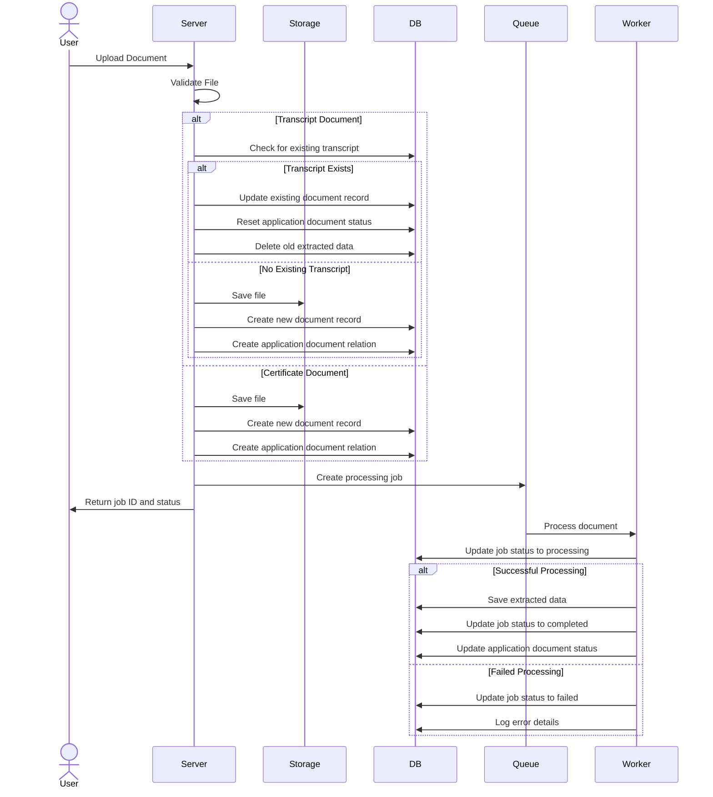

# Document Processing Flow and Strategy

This document outlines the flow and strategy for handling document uploads in the Lê Lợi School application, specifically focusing on the different approaches for transcript and certificate document types.

## Core Requirements

1. **Transcript Documents**:
   - Only one transcript document per student (per application)
   - Each new upload replaces the previous transcript
   - Must be in PDF format

2. **Certificate Documents**:
   - Multiple certificates allowed per student (per application)
   - New uploads are added as additional documents
   - Must be in image format (JPEG, PNG, WEBP, etc.)

## Document Processing Flow

The document processing follows this flow:

1. **Upload**: User uploads a document file (transcript or certificate)
2. **File Storage**: System stores the file in the designated storage location
3. **Database Entry**: System creates or updates database records
4. **Job Creation**: System creates a processing job
5. **Worker Processing**: Background worker processes the document
6. **Data Extraction**: System extracts data from the document
7. **Verification**: Data can be verified by users or administrators

### Sequence Diagram



## Implementation Strategy

### 1. Transcript Documents (Single Document Strategy)

When a user uploads a transcript document:

1. **Check for Existing**: The system checks if a transcript document already exists for this application
2. **If Exists**: 
   - Update the existing document record with new file information
   - Reset the application document status to "pending"
   - Delete any extracted data associated with the old document
   - Remove existing processing jobs if any
3. **If Not Exists**:
   - Create a new document record
   - Create a new application document relationship
4. **Process**:
   - Create a new job for the transcript processing queue
   - The worker extracts student data from the transcript

### 2. Certificate Documents (Multiple Documents Strategy)

When a user uploads a certificate document:

1. **Always Create New**: The system always creates a new document record for each certificate
2. **Database Entries**:
   - Create a new document record
   - Create a new application document relationship
   - Set initial status to "pending"
3. **Process**:
   - Create a new job for the certificate processing queue
   - The worker validates the certificate and extracts any relevant data

#### Certificate Organization

Certificates are organized in the following ways:

1. **Type-Based Classification**: Certificates can be classified by type (e.g., language certificates, awards, etc.)
2. **Date-Based Sorting**: Certificates are displayed newest-first by default
3. **Status-Based Filtering**: Certificates can be filtered by processing status (pending, completed, failed)

When retrieving certificates, the system provides pagination to handle potentially large numbers of certificates.

## Database Schema Relationships

The system maintains the following relationships:

```
Application -1:N-> ApplicationDocument -N:1-> Document
                                       
Document -1:1-> ExtractedData
```

- An Application can have multiple ApplicationDocuments
- Each ApplicationDocument is linked to one Document
- Each Document can have one ExtractedData record

### Certificate-Specific Records

For certificates, additional metadata can be stored:

```json
{
  "certificateType": "language_proficiency",
  "issueDate": "2023-01-15",
  "issuer": "Cambridge Assessment",
  "validUntil": "2025-01-15"
}
```

This metadata is stored in the `metadata` field of the Document record and can be used for filtering and sorting.

## Job Processing

Document processing jobs are managed through BullMQ queues:

1. **Transcript Queue**: Handles transcript document processing
2. **Certificate Queue**: Handles certificate document processing

Jobs include:
- Document file information
- Processing status
- User ID for traceability
- Application document ID for relationship tracking

### Job Priority

Jobs can be prioritized based on:

1. **Document Type**: Transcript processing may have higher priority than certificates
2. **Time Sensitivity**: Documents needed for immediate application steps
3. **Retry Status**: Failed jobs being retried might get lower priority

## Error Handling

The system implements comprehensive error handling:

1. **File Validation Errors**: Checks for file type, size, and format before processing
2. **Transaction Rollback**: Uses database transactions to ensure data consistency
3. **Job Monitoring**: Tracks job status and captures processing errors
4. **Logging**: Detailed logging throughout the process for debugging and auditing

## Cleanup Strategy

Old files and processing data are managed as follows:

1. **Transcript Updates**: When a new transcript is uploaded, the old file remains but the database records point to the new file
2. **Extracted Data**: When a document is updated, its extracted data is deleted to avoid inconsistencies
3. **Failed Jobs**: Jobs that fail are retained in the failed jobs list for troubleshooting

## API Response Structure

The document upload API returns:

```json
{
  "success": true,
  "message": "Document uploaded successfully",
  "data": {
    "id": "job-id-string",
    "jobId": "queue-job-id",
    "status": "pending"
  }
}
```

This information can be used to check the processing status later.

## API Endpoints

### Upload Document
`POST /registration/document-upload`

### Get Documents for Application
`GET /registration/application/{applicationId}/documents`

### Get Extracted Data
`GET /registration/document-upload/{documentId}/extracted-data`

### Verify Document Data
`PATCH /registration/document-upload/extracted-data/{extractedDataId}`

## Future Enhancements

1. **Batch Certificate Upload**: Allow users to upload multiple certificates at once
2. **Certificate Organization**: Implement UI for organizing and categorizing certificates
3. **OCR Improvements**: Enhance the OCR process for better data extraction
4. **Document Versioning**: Track changes to documents over time
5. **Advanced Certificate Verification**: Implement digital signature verification for certificates 